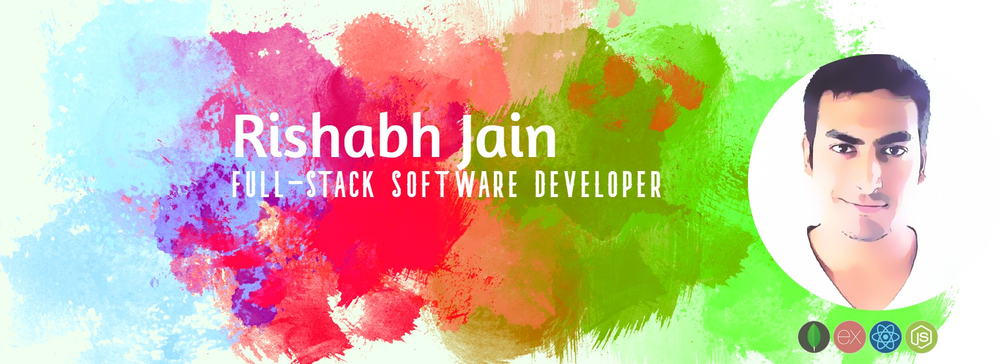

# Hi, I'm Rishabh 👋🏼 :octocat:

I'm a full-stack developer proficient in Javascript, React JS and Node JS.

- 🔭 I’m currently working on building a SaaS application in MERN stack + AWS Lambda functions.
- 🌱 I’m currently learning JAM stack and GraphQL.
- 👯 I’m looking to collaborate on React based web apps.
- 💬 Ask me about transitioning from QA/SDET role to Development.
- ⚡ Fun fact: I'm a 2nd Career Dev after 1+ years in Event Industry.

## Find me around the web 🌎 : 

-Follow my <a href="http://factslab.com/">Blog</a> 📹 ✍🏾
- View my past experience on  <a href="https://www.linkedin.com/in/rishabhjaindev/">LinkedIn</a> 💼

